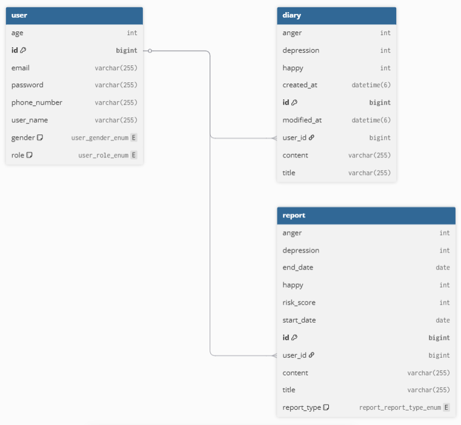
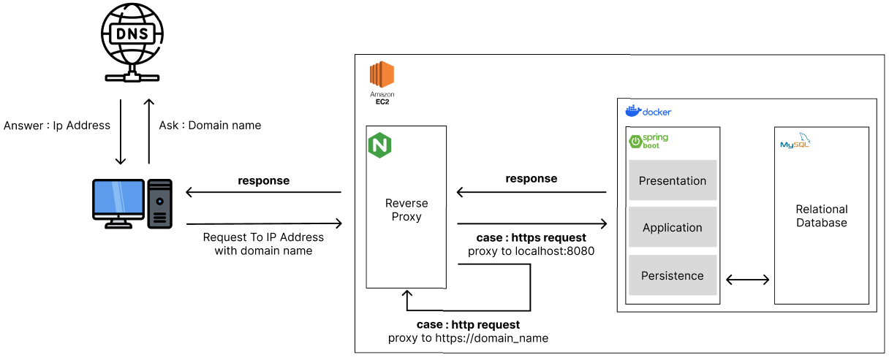
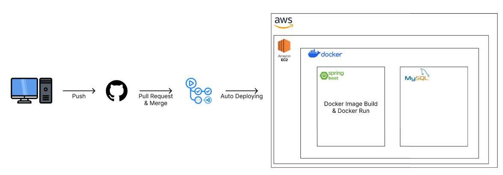

# 📕 Aiary

## 기여자
<table>
<tr>
<td>

|                     BaeJunH0                       |
| :------------------------------------------------: |
|  |
|     [@BaeJunH0](https://github.com/BaeJunH0)       |
|          National - 🇰🇷 Republic Of Korea           |

</td>
<td>

|                  hyun7586                   |
| :------------------------------------------------: |
|  |
|     [@hyun7586](https://github.com/hyun7586) |
|          National - 🇰🇷 Republic Of Korea            |

</td>
</tr>
</table>

## 🙄 프로젝트 구상 이유
> **Aiary**는 누구나 **일기 작성을 통해 감정 분석 및 도움을 받을 수 있는** 서비스입니다.
>
> 기존의 정신건강 지원 서비스는 오프라인 위주의 구조로, 명확한 진입 장벽이 존재했습니다.
>
> 이를 해결하기 위해서 익명성과 비대면성의 강점을 가진 기술 기반 접근을 택하였습니다.
>
> 간단한 일기 작성만으로 자신의 상태를 파악하고 도움을 받을 수 있습니다.

## 저장소
> [**_BackEnd_**](https://github.com/TeamAiary/TA_BE)
>
> [**_FrontEnd_**](https://github.com/TeamAiary/TA_Android)

## 프로젝트 주요 기능
**1. 로그인 및 회원가입 기능**
- 자체 로그인 기능 + ~Oauth 기능~

**2. 일기 작성 기능**
- 하루에 한 편씩, 일기를 작성할 수 있음

**3. 리포트 열람 기능**
- 1주, 1달에 한 편씩 주간, 월간 리포트를 열람할 수 있음
- 이는 스케줄링 + open ai api를 이용하여 작성됨

## 설계

**ERD**

**Architecture**

**Git Flow**

## 기술 스택
> Framework
>

> DB
>

> Deploy & Automation
>

> Collaboration Tool
>

## 참조
[추가 예정...]()
